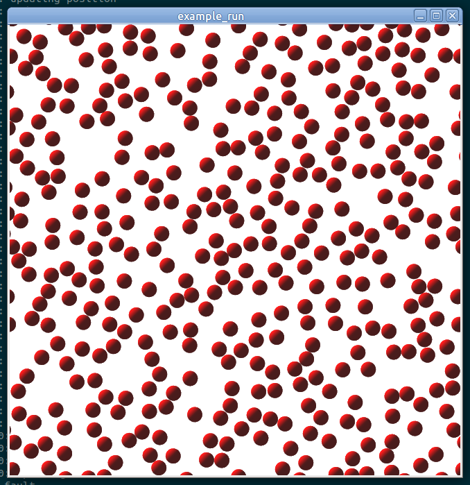
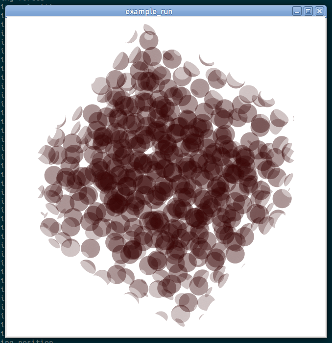

# Molecular Dynamics Simulation of Simple Particles

This package performs molecular dynamics simulation using truncated and shifted Lennard-Jones potential
along with velocity Verlet algorithm.

This was for a university project in 2011.


## Usage

### Installation
```bash
# in <root>/
git clone https://github.com/mm318/molecular-dynamics-simulation.git
```

### Build
```bash
# from <root>/
mkdir build
cd build
cmake ../molecular-dynamics-simulation
make
```

### Run
Usage:
```text
mdsim_2d <dt> <num steps> <run name> [output png prefix]
mdsim_3d <dt> <num steps> <run name> [output png prefix]
```

Example:
```bash
mdsim_2d 0.001 100 example_run example_run_2d
mdsim_3d 0.001 100 example_run example_run_3d
```

2D run visualization:  


3D run visualization:  



## Requirements

Tested on Ubuntu 20.04.


## Dependencies

- [thr_pool](https://docs.oracle.com/cd/E19120-01/open.solaris/816-5137/ggedn/index.html)
- [libpng](http://www.libpng.org/pub/png/libpng.html) - The zlib/libpng License
- [zlib](https://zlib.net/) - The zlib/libpng License
